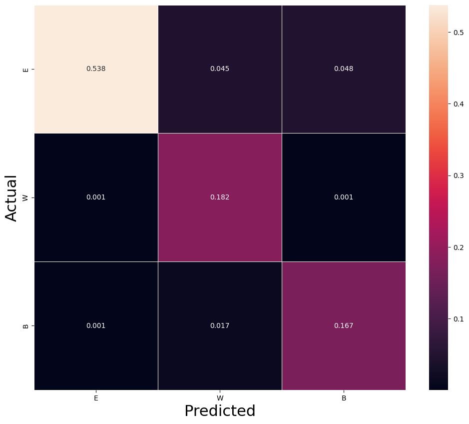

# fenify-3D

Fenify-3D is a specialized project leveraging AI, Machine Learning (ML), and deep learning technologies to transform real-world images of chess boards into corresponding Forsyth-Edwards Notation (FEN) strings.


## Table of Contents

1. [Introduction](#introduction)
2. [Dataset](#dataset)
3. [Training](#training)
4. [Accuracy](#accuracy)
5. [Inference](#inference)

## Introduction 

The Forsyth-Edwards Notation (FEN) is a standard notation crucial for delineating specific board positions in a chess game. FEN encapsulates all essential information, enabling the recommencement of a game from a defined position.

Fenify-3D is engineered to analyze an image of a physical chess board and deliver a precise FEN string, illustrating the current state of the board. This facilitates the real-time transcription of chess games through video input in downstream applications.

Distinct from existing chess game recording systems utilizing image and video data, Fenify-3D presents an innovative approach. It operates without necessitating a "top-down" perspective of the board, and accomidates various angles, provided the board maintains reasonable visibility. This refinement enhances the adaptability and applicability of the system in diverse real-world scenarios. 

## Dataset 

The training dataset was composed of two primary components: synthetic and crowdsourced data.  

### Synthetic

Initial work started with synthetic data to determine project viability.  


#### Simulator

Synthetic data was generated using Unity, employing chess boards and pieces sourced from Unity's Asset Store. Eight distinctive board sets were utilized (LowRes, Staunton, Abstract, Carved, Design, Dual, Medieval, ModernArt), paired with five unique piece sets (LowRes, HighRes, Staunton, Carved, Dual). A normalization process was applied to the dimensions of each board and piece set, ensuring compatibility and interchangeability among different sets.

In the Unity environment, randomization techniques were applied to foster a robust diversity of data within the confines of the simulated environment. The key factors subject to randomization included:

- Board Set
- Piece Set (accompanied by size jitter)
- Camera attributes such as position, angle, and focal point
- Placement of individual pieces
- Lighting attributes such as intensity and direction
- Background color

#### Piece Distribution

An initial research focus was on optimizing the randomization of the chess board to achieve two primary objectives:
- Enable replication using a physical board and piece set
- Minimize class imbalance to facilitate training

Various piece distributions were explored and experimented with, as summarized below:

| Distribution Type                | Description                                                                                       |
|----------------------------------|---------------------------------------------------------------------------------------------------|
| HalfEmptyRandomDistribution      | Each square has a 50% probability of being empty or occupied by a random piece.                    |
| StartingPositionDistribution     | Pieces are distributed based on the starting position with random square assignments.              |
| CompetitionDistribution          | Boards are selected randomly from a collection of positions from over 7k+ competitive games (Elo > 2000).|

A "FullyRandomDistribution" approach was not pursued due to impractical levels of occlusion resulting from overlapping pieces.

The HalfEmptyRandomDistribution method was dismissed following attempts to recreate it physically. The need for multiple piece sets per board made it impractical for use with crowdsourced participants.

CompetitionDistribution introduced a systemic bias due to the historical positioning of pieces, impeding optimal learning of visual features, as confirmed through experimentation. Thus, it was reserved for fine-tuning and test sets at later stages.

StartingPositionDistribution, despite its inherent challenges such as class imbalance and a fixed piece set, was chosen due to its feasibility for crowdsourcing, as it only necessitates the use of the standard chess sets. Training experiments conducted on synthetic data, affirmed the viability of training using the StartingPositionDistribution.

#### Generation


A dedicated Unity application was developed for the generation process. This application was tasked with randomizing various aspects, including the board, pieces, and the environment, followed by capturing a screenshot and saving it to the filesystem. This process was repeated in iterations.

Alongside the images, bounding box coordinates of the chessboard were also saved. This additional data facilitates the cropping of images to focus on relevant visual information, ensuring that the analysis is confined to the essential regions of the images.

In total, the application generated a dataset consisting of 30,000 diverse images.

### Crowdsourced


Following a series of initial training experiments that yielded positive results, the methodology employed in synthetic data collection was expanded to incorporate crowdsourcing via Mechanical Turk. A coherent set of instructions, complemented by a compact web application, was developed and refined through an iterative process of trial and error. This approach facilitated the engagement of a broader participant base, leveraging diverse environments to enhance and enrich the dataset beyond the limitations of purely synthetic generation techniques.

#### Data Augmentation


Constructing the simulation tool was a time-intensive process. However, it enabled the generation of incremental board images in a matter of milliseconds without requiring manual intervention. Conversely, arranging each randomized real-world board was a meticulous task, demanding careful and deliberate effort.

To optimize the data obtained from each uniquely arranged board, a strategy was employed to capture images from all four sides of the board, yielding four distinct images per arrangement. In a subsequent phase during training, these images, along with their board positions, will be subjected to random horizontal flips. This technique aims to enhance the dataset, effectively producing eight varied images from a single arranged board, thereby maximizing the utility of each manual arrangement in enriching the dataset for model training.

#### Collection Task


The data collection procedure was refined through an iterative process of trial and error, as the author engaged in hands-on data gathering. A web application, hosted on Google Cloud, was developed to facilitate this process, with a design optimized for mobile user accessibility and interaction.

The application interface was organized systematically: 
- At the top, a randomly generated chessboard was displayed, complemented by its rotational views, utilizing a UI powered by chessboard.js for enhanced visibility and user experience.
- Following this, a 3D visualization was presented, showcasing a randomized angle of the chessboard for users to replicate.
- The lower section of the application featured a form with fields for uploading up to four images, an ID field, and a submission button.

Upon submission, the collected image files were securely stored in Google Cloud Storage, awaiting subsequent review and utilization in the project’s data processing and analysis stages.

#### Mechanical Turk 


Administering the data collection process via Mechanical Turk and ensuring the submission quality posed substantial challenges. 

A significant portion, approximately 75%, of submissions from MTurk workers consisted of readily available stock images of chess boards sourced online. Such submissions necessitated removal, and the responsible workers were subsequently blocked. Genuine contributions, originating from workers who diligently followed the instructions, were less frequent. These contributors often reached the preset individual limit of 50 submissions. Instances of workers circumventing this restriction through the use of multiple accounts were also observed and necessitated vigilant monitoring and blocking to maintain the integrity of the data collection process. The imposition of the submission limit aimed to foster data diversity, preventing the overrepresentation of data from a limited number of contributors.

On average, each board arrangement consumed about 3 minutes of effort, culminating in the approval of 9505 images, 2500 of which were contributed by the author. Considering that each arrangement yielded four images, the total human effort invested amounts to approximately 120 hours. Overall, contributions were received from 150 distinct workers, with a select few surpassing the 50-board submission threshold. The financial expenditure for the Mechanical Turk utilization in this project amounted to approximately $1550.


The dataset exhibited a pronounced skewness towards contributions from the author and a select group of reliable data gatherers who had access to multiple environments. This concentration of data sources resulted in a high standard of piece placement accuracy; however, it also limited the diversity of the dataset. Notably, approximately a quarter of the data originated from a limited number of settings orchestrated by the author. This lack of variety could potentially affect the model's ability to generalize to a broader range of real-world conditions. Addressing this imbalance is critical for enhancing the robustness and reliability of the model across varied chessboard setups and environments.

#### Quality Assurance

Maintaining high data quality necessitated substantial quality assurance efforts. Fortunately, the majority of issues encountered were common and could be addressed through automated corrective measures.

One recurrent issue was the misidentification of kings and queens in the crowdsourced submissions. Workers who made this error typically did so consistently across all their submissions. To rectify this, an automated process was implemented that programmatically adjusted the board assignments, swapping the positions of the king and queen. This approach resolved the issue effectively without necessitating resubmission by the worker.

Ambiguities in piece colors, particularly in certain piece sets, also presented challenges. This was especially notable in glass sets, where distinguishing between colors was somewhat nuanced. To standardize the data, clear pieces were uniformly categorized as black, and frosted pieces as white, with programmatic adjustments made to correct any inconsistencies without the need for resubmission.

Incorrect rotation orders were another common discrepancy, leading to mismatches between images and their corresponding board assignments. Initially, such boards were disqualified. However, with the availability of a trained model, automated corrections were introduced to identify and adjust improper rotations, thereby preserving the integrity of the data.

Minor piece placement errors were tolerated to a degree, permitting a small margin of one or two misplaced squares per sixty-four. Boards exhibiting more than two placement errors were deemed unacceptable. A comprehensive review of every square in each image was impractical. Typically, validations focused on the back row, and if found accurate, the remainder of the board was assumed to be correct.

Upon the establishment of a sufficiently trained model, the entire dataset underwent a comprehensive review and correction process to identify and amend any lingering data quality issues. 

## Training

Previous open-source models for board detection typically preprocess the image by segmenting the board into 64 individual squares, analyzing each square in isolation. In contrast, Fenify-3D eschews this preprocessing step, opting instead to infer the state of all 64 squares directly from the full board image. Although this approach presents greater challenges during the training phase, it confers the advantage of tolerating wider viewing angles and maintaining robustness in the presence of occlusion.   

### Dataset and Augmentation


The training dataset comprises 30,000 synthetic images alongside 9,505 images sourced via crowdsourcing. During the training process, the dataset was expanded through the use of color and geometric transformations. However, this augmentation was constrained by certain considerations. Vertical flips, extensive rotations, and horizontal flips could not be utilized as they would fundamentally alter the pieces' visual identifiers, given that piece placement is dependent on the angle of view and not fixed. To accommodate horizontal flips, both image and board transformations were synchronized. Color augmentations were deliberately restrained to avoid the inversion of pixel intensity, which would result in an erroneous assignment of piece colors.

The following transforms were used during training:
```python
T.ColorJitter(brightness=0.25, contrast=0.25, saturation=0.25, hue=0.25)
T.RandomRotation(degrees=(-15,15))
T.RandomPerspective(distortion_scale=0.25)
T.Grayscale(num_output_channels=3)
FlipTransform()
```

### Model

The frameworks utilized for training the model were Pytorch, TorchVision, and Pytorch Lightning. The architecture of the model centered around an EfficientNetV2_S as the image decoder, coupled with a linear output layer that features 819 nodes. This design allows for the grouping of the chessboard's sixty-four squares, with each square having thirteen potential outputs corresponding to different pieces or lack thereof.

Within the model's forward function, the linear layer's output is reshaped into a 64x13 matrix. Following this, a softmax function is applied along the piece dimension, which effectively yields the probability distributions for piece predictions across the entire chessboard.

Notably, only the EfficientNet series, including EfficientNet_B4 and EfficientNetV2_S, successfully achieved convergence and produced results with substantial accuracy. Contrarily, other renowned architectures like Resnet50 did not attain an accuracy level sufficient for practical application in this context.  

```python
class Model(pl.LightningModule):

    def __init__(self, resnet=None, piece_sets=[PieceSet.Binary, PieceSet.Colors, PieceSet.ColorBlind, PieceSet.Full],
                 lr=0.0001):
        super().__init__()
        self.piece_sets = piece_sets
        self.lr = lr
        self.resnet = resnet
        self.outputs = nn.Linear(1000, 64*13)
        self.losses = nn.ModuleList()
        for pc in piece_sets:
            loss = nn.CrossEntropyLoss(weight=pc.weights())
            self.losses.append(loss)

    def forward(self, x):
        x = F.relu(self.resnet(x))
        x = self.outputs(x)
        x = torch.reshape(x, (x.shape[0], 64, 13))
        return F.softmax(x,dim=2)
```

### Loss Function

The initial training approach, which involved predicting the class of each square directly, proved challenging due to the complexity of mapping visual features to precise board positions. To address this, the model was adapted to include various piece sets, allowing it to earn "partial credit" for near-accurate predictions. For instance, if the model confidently predicted a white queen instead of a white king in the Full piece set, it would incur full loss. However, with the Binary and Colors piece sets, this prediction would not count as an error since the color match was correct.

The training process eventually achieved convergence by employing a combination of Binary, Colors, ColorBlind, and Full piece sets. This multi-tiered approach enabled the model to gradually recognize crucial features by first excelling at simpler versions of the prediction task, thereby creating a more manageable learning gradient and facilitating the capture of essential characteristics for the more complex Full piece set classification.


| Piece Set                | Descriptor |
|---------------------|------------|
| Binary              | empty / piece |
| Colors              | empty / white / black |
| MajorMinor          | empty / white minor / white major / black minor / black major |
| RoyalMajorMinor     | empty / white minor / white major / white royal / black minor / black major / black royal |
| ColorBlind          | empty / pawn / knight / bishop / rook / queen / king |
| Full                | empty / white pawn / white knight / white bishop / white rook / white queen / white king / black pawn / black knight / black bishop / black rook / black queen / black king |

### Hyperparameters and Scheduling


The composition of the training and validation sets was derived from a total of 39,505 images, split into 90% for training and 10% for validation, blending synthetic and crowdsourced data. An initial batch size of 16 images and a learning rate of 1e-4 were selected for the training phase, which spanned approximately 60 epochs and lasted close to ~10 hours.  A second phase with a batch size of 32 images and a learning rate of 1e-4 trained for another 40 epochs for another ~7 hours.  All training was done on a V100 Colab instance as shown in `training.ipynb` but due to unexpected restarts the exact training run was lost. 

## Accuracy

### Validation Set

#### Gross Metrics

The validation set comes from the same data distribution as the training set.  The following is the gross metrics from the validation set:

| Metric                  | Value                 |
|-------------------------|-----------------------|
| Loss                    | 3.88     |
| Binary Accuracy         | 0.999    |
| Colors Accuracy         | 0.974    |
| Color-blind Accuracy    | 0.974    |
| **Full Accuracy**         | **0.950**    |

#### Prediction Visualization

The graphic below is a visual example of four randomly selected images from the validation set including the raw image, the board's actual or correct position, the predicted position, and the full piece accuracy.    An X on the predicted column indicates an inaccurate square prediction.  


The model shows strong predition performance by only predicting one to three squares incorrectly per board. 

#### Confusion Matrix 

The analysis of the confusion matrices highlights the model's predictive strengths and areas where further improvement could be beneficial.

*Colors Confusion Matrix*


The confusion matrix for color prediction demonstrates a high level of accuracy in distinguishing between binary and colored piece sets. It reveals a minor tendency for the model to overpredict the presence of white pieces when they are actually black.

*Color Blind Confusion Matrix*
 

For the color blind confusion matrix, a logarithmic scale is employed to enhance visibility of problematic prediction areas. The first square, representing correct predictions for empty squares, is omitted to accentuate the predictive performance for actual pieces. The matrix indicates a notable challenge in correctly identifying pawns, with a higher rate of false negatives observed. Knights and bishops are frequently misclassified as pawns, likely due to visual similarities in certain perspectives and piece designs.

*Full Confusion Matrix*


Similar to the color blind matrix, the full confusion matrix employs a logarithmic scale to better illustrate areas of misprediction. Regions without confusion are left unmarked. The most significant issue arises with the misidentification of black pawns, as indicated by the rate of false negatives. It is also observed that white pieces are occasionally mistaken for their black counterparts, which is reflected by a line parallel to the identity diagonal, representing correct predictions.

#### Analysis 

The model demonstrates commendable performance on StartingPositionDistribution randomized boards, achieving, on average, a per-square accuracy of 95%, with typically 3.2 squares misclassified out of 64.

Errors in predictions are generally confined to either piece type or color, rather than both. Interestingly, the model exhibits similar accuracy rates (97.4%) for predicting both piece type and color, despite piece prediction appearing more challenging. This could suggest an underlying issue, potentially arising from competing loss functions in the 'Colors' and 'ColorBlind' piece sets. Although prior ablation studies suggested the 'ColorBlind' piece set contributed value to the model's performance, this assumption may require reassessment given the current evidence.

Utilizing true random piece arrangements eliminates the model's ability to leverage common chess positions to improve its visual recognition capabilities, enforcing a stringent standard that each prediction must rely solely on visual cues without the benefit of statistical shortcuts. However, it appears that the model may be utilizing the fixed piece count inherent to the data collection design, as this is reflected in its performance on the test set.

This assessment indicates that while the model is performing well, there is room for further refinement.

### Test Set

The test set comes from a different data distribution than the training set.  It is composed of videos of actual games. The following is the gross metrics from the test set:

| Metric                        | Value   |
|-------------------------------|---------|
| Loss                          | 4.191   |
| Binary Accuracy               | 0.905   |
| Colors Accuracy               | 0.887   |
| Color-Blind Accuracy          | 0.864   |
| **Full Accuracy**                 | **0.852**   |

#### Prediction Visualization

The graphic below is a visual example of four randomly selected images from the test set including the raw image, the board's actual or correct position, the predicted position, and the full piece accuracy.  An X on the predicted column indicates an inaccurate square prediction. 


The model performs quite poorly compared to the model on the validation set.  

#### Confusion Matrix 

The analysis of the confusion matrices highlights the model's predictive strengths and areas where further improvement could be beneficial.

*Colors Confusion Matrix*


The confusion matrix for color prediction in the test set shows the deep accuracy flaws in the model for the test set.  The model significantly over predicts pieces on empty squares.

#### Analysis 

The included visualization delineates the prediction challenges encountered by the model on the test dataset:


The model's accuracy improves with an increased number of pieces on the board. This trend suggests a systematic bias stemming from differences between the training/validation sets and the test set, with the model demonstrating a propensity to predict board occupancy close to 50% even in the absence of pieces.

To enhance the model's predictive performance on the test dataset, an additional phase of training is warranted. Leveraging a fine-tuning set comprised of actual game positions—akin to the approach utilized in 'fenify'—should yield improvements. Such a dataset would enable the model to harness statistical piece correlations to refine its predictions.

Given the relative simplicity of predicting empty squares, a modest training epoch count on a dataset comprising a few thousand images should suffice to mitigate the model’s bias toward specific piece counts.

## Inference

The inference code is shown in `predict.py` and `main.py`.  Prediction uses a Pytorch TorchScript jit compiled model.  The latest model can be found in releases. 

BoardPredictor encapsulates the required pre and post processing steps in order to use the model.  BoardPredictor can return a fully formed `chess.Board` with predict or confidence results of type `dict[chess.Square, list[float]]` with predict_with_confidence.
```python
class BoardPredictor:
    def __init__(
        self, model_file_path: str = "assets/2022-06-01-chesspic-fen-model-cpu.pt"
    ) -> None:
        self.model = torch.jit.load(model_file_path)
        self.img_transform = T.Compose(
            [
                T.Resize((400, 400)),
                T.Lambda(lambda img: img.convert("RGB")),
                T.ToTensor(),
                T.Normalize(mean=[0.485, 0.456, 0.406], std=[0.229, 0.224, 0.225]),
            ]
        )

    def predict(self, image_file_path: str) -> chess.Board:
        img = Image.open(image_file_path)
        x = self.img_transform(img)
        img_batch = torch.unsqueeze(x, 0)
        y_hat = self.model(img_batch)
        y_hat = torch.squeeze(y_hat)
        y_hat_board = torch.argmax(y_hat, dim=1)
        y_hat_board = torch.reshape(y_hat_board, (8, 8))
        y_hat_board = Board.from_array(y_hat_board.cpu().numpy())
        return y_hat_board.board

    def predict_with_confidence(
        self, image_file_path: str
    ) -> dict[chess.Square, list[float]]:
        img = Image.open(image_file_path)
        x = self.img_transform(img)
        img_batch = torch.unsqueeze(x, 0)
        y_hat = self.model(img_batch)
        y_hat = torch.squeeze(y_hat)
        d = {}
        for sq in range(64):
            d[sq] = y_hat[sq].tolist()
        return d
```

A convience script is available in `main.py`:
```bash
python main.py model.pt readme-assets/prediction_example.png
```